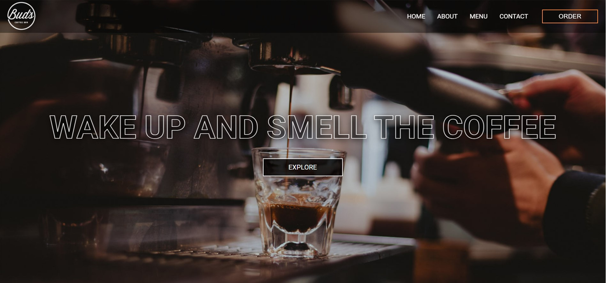

# Bud's Coffee Bar

Bud's Coffee Bar is a single-page web application (SPA) built with React. It features an about section, a menu section, a map section, and a contact section. The map is displayed using the Google Maps Embed API, and the contact forms are sent using EmailJS.

## Usage

To start the application, run npm install and then npm start in the project directory. The application should open in your default web browser at http://localhost:3000.

## Navigation

You can navigate to the different sections of the app using the navigation bar at the top of the page. Navigation is rendered dynamically from the navigation links array.

### About

The about section provides information about Bud's Coffee Bar.

### Menu

The menu section displays a list of coffee and tea drinks, as well as pastries and other food items available along with their prices. The menu sections and items are rendered dynamically from the menu items array.

### Map

The map section shows the location of Bud's Coffee Bar on a map using the Google Maps Embed API.

### Contact

The contact section allows users to send a message to Bud's Coffee Bar using a contact form. The form is validated using React and powered by EmailJS, which sends the message to a designated email address.

## Dependencies

The application has the following dependencies:

React
React Router
React Scroll
Font Awesome
EmailJS
Google Maps Embed API

These dependencies are listed in the package.json file and are installed automatically when you run npm install.

## Author

The site was designed and built by Sarah Salvatore.
